# Injector Lab — CyberDefenders Writeup

**Category:** Endpoint Forensics
**Tactics:** Initial Access · Execution · Persistence · Privilege Escalation · Defense Evasion · Discovery
**Tools:** FTK Imager · Autopsy · Volatility 3 · Registry Explorer · RegRipper · CyberChef · Strings

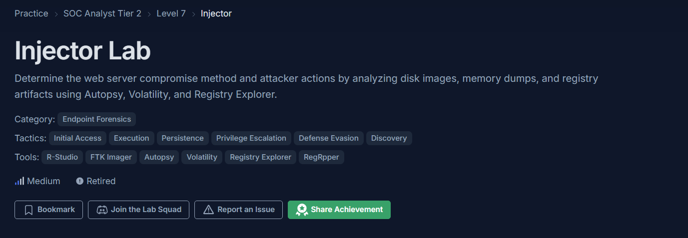

## Scenario

A web server was compromised. The goal of this investigation is to determine the initial compromise vector and reconstruct the attacker's actions using a disk image and a memory dump, by analyzing registry hives, web server logs, and volatile memory artifacts.

## Tools Setup

- **FTK Imager** — mount/export the disk image and extract registry hives (`SYSTEM`, `SOFTWARE`, `SAM`) from `Windows\System32\config`
- **Registry Explorer** — parse extracted hives for system, user, and persistence artifacts
- **Autopsy** — browse the filesystem for web server logs and dropped files
- **Volatility 3** — analyze the memory dump (`memdump.mem`) for process listings, dumped process memory, and credential material
- **CyberChef** — decode hex-encoded payloads captured in the web logs

---

## Question 1 — What is the computer's name?

Extracted the `SYSTEM` hive and loaded it in Registry Explorer, then navigated to:

```
HKLM\SYSTEM\ControlSet001\Control\ComputerName\ComputerName
```

The `ComputerName` value holds the machine's NetBIOS/hostname.

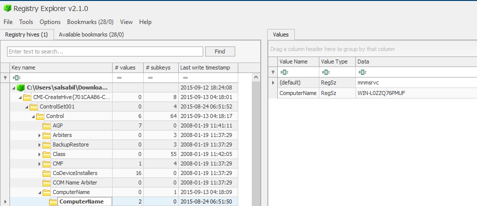

**Answer:** `WIN-L0ZZQ76PMUF`

---

## Question 2 — What is the timezone of the compromised machine? (Format: UTC+0, no space)

In the same `SYSTEM` hive, navigated to:

```
HKLM\SYSTEM\ControlSet001\Control\TimeZoneInformation
```

The `TimeZoneKeyName` value is `Pacific Standard Time`, and the `ActiveTimeBias` is `420` minutes (7 hours behind UTC).

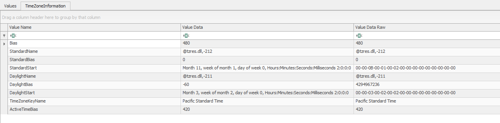

**Answer:** `UTC-7`

---

## Question 3 — What was the first vulnerability the attacker was able to exploit?

A `xampp` directory on the filesystem indicates Apache/PHP was the web stack in use. Apache logs every request to `access.log`, making it the primary source for reconstructing the attack timeline. Filtering `C:\xampp\apache\logs\access.log` chronologically (sorted by timestamp, since this is the *first* exploited vulnerability), the earliest suspicious request is a GET to `/dvwa/?test=%22><script>eval(window.name)</script>`, an XSS payload injected via a URL parameter, followed immediately by a request to DVWA's `security.php`.

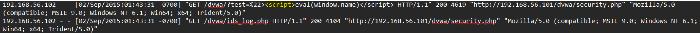

**Answer:** `XSS`

---

## Question 4 — What is the OS build number?

Extracted the `SOFTWARE` hive and navigated to:

```
HKLM\SOFTWARE\Microsoft\Windows NT\CurrentVersion
```

The `CurrentBuildNumber` value (highlighted) gives the build number.

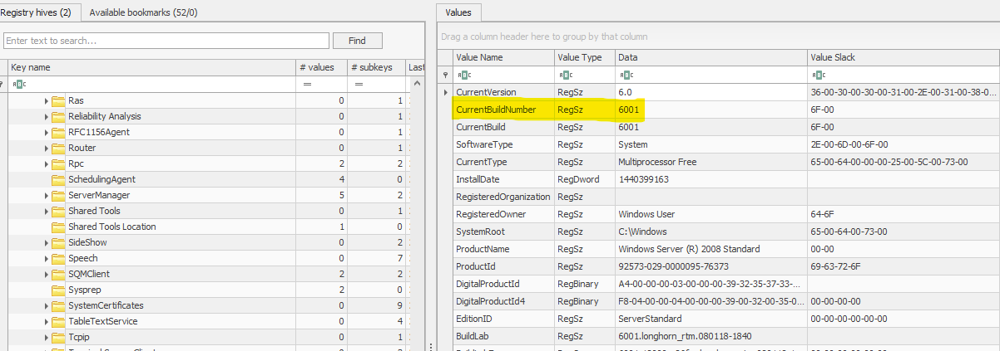

**Answer:** `6001` *(consistent with Windows Server 2008 Standard, confirmed by the `ProductName` value in the same key)*

---

## Question 5 — How many users are on the compromised machine?

User accounts are stored in the `SAM` hive. Navigated to:

```
SAM\Domains\Account\Users\Names
```

Four named subkeys are present: `Administrator`, `Guest`, `hacker`, and `user1`.

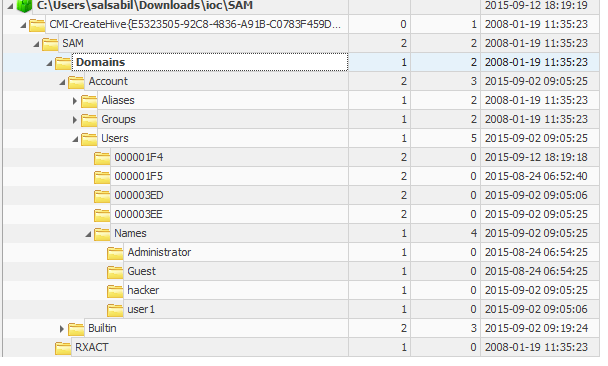

**Answer:** `4`

---

## Question 6 — What is the webserver package installed on the machine?

The filesystem contains a top-level `C:\xampp` directory, and the Apache log path used throughout this investigation (`C:\xampp\apache\logs\access.log`) confirms Apache is running under the XAMPP distribution rather than a standalone install. XAMPP bundles Apache, MySQL/MariaDB, PHP, and Perl, which matches the services (`httpd.exe`, `mysqld.exe`) later observed in the memory dump's process list (Question 17).

**Answer:** `XAMPP`

---

## Question 7 — What is the name of the vulnerable web app installed on the webserver?

The exploited URL paths throughout the logs (`/dvwa/...`, `/dvwa/vulnerabilities/sqli`, `/dvwa/vulnerabilities/fi`, `/dvwa/security.php`) all sit under a `/dvwa/` web root. DVWA (Damn Vulnerable Web Application) is a well-known intentionally vulnerable PHP/MySQL app used for security training, and its directory structure (a `vulnerabilities` folder containing named modules like `sqli` and `fi`) matches exactly what's seen in the requests.

**Answer:** `DVWA`

---

## Question 8 — What is the user agent used in the HTTP requests sent by the SQL injection attack tool?

DVWA's SQL injection module lives under `/dvwa/vulnerabilities/sqli`. Filtering `access.log` for that path shows a string of automated, parameterized requests (UNION-based payloads enumerating `information_schema.tables`) consistent with a SQLi scanner rather than manual testing. The `User-Agent` string on these requests is:

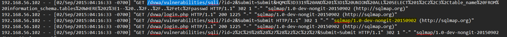

**Answer:** `sqlmap/1.0-dev-nongit-20150902`

---

## Question 9 — The attacker read multiple files through an LFI vulnerability. One was related to network configuration. What is the filename?

DVWA's File Inclusion module lives under `/dvwa/vulnerabilities/fi`. Filtering `access.log` for that path shows a `page` parameter being manipulated with directory traversal sequences, e.g.:

```
GET /dvwa/vulnerabilities/fi/?page=../../../../../windows/system32/drivers/etc/hosts
```

The `hosts` file under `drivers\etc\` is the standard Windows network configuration file used for static hostname-to-IP mappings.

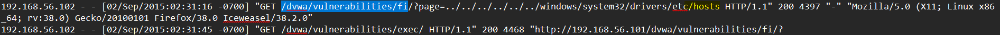

**Answer:** `hosts`

---

## Question 10 — The attacker updated firewall rules using `netsh`. Provide the value of the `type` parameter in the executed command.

Extracted strings from the memory dump (`memdump.mem`) using Volatility's string-extraction workflow:

```powershell
.\strings_tool\strings64.exe -accepteula -n 6 "<memdump.mem>" > strings.txt
```

Searching the output for `netsh` reveals the firewall rule the attacker pushed to allow inbound RDP traffic:

```
netsh firewall set service type=remotedesktop mode=enable scope=subnet
```

This command modifies the legacy Windows Firewall service definition to permit Remote Desktop connections — consistent with the attacker's later move to RDP-enable a newly created account (see Questions 11–17).

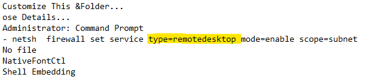

**Answer:** `remotedesktop`

---

## Question 11 — How many users were added by the attacker?

Re-examining the `SAM` hive's `Users` key, two RIDs were created within the same short window (`2015-09-02 09:05:06`–`09:05:25`), corresponding to the `hacker` and `user1` accounts seen earlier in Question 5. Both fall outside the default `Administrator`/`Guest` accounts that ship with the OS.

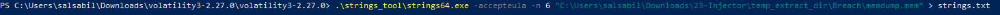

**Answer:** `2`

---

## Question 12 — When did the attacker create the first user?

The `Users` subkey `000003ED` (corresponding to `user1`) has a last-write timestamp of `2015-09-02 09:05:06`, which is the earlier of the two new accounts and represents the first user created by the attacker.

**Answer:** `2015-09-02 09:05:06 UTC`

---

## Question 13 — What is the NT hash of the password set by the attacker?

Volatility 3 no longer ships `hashdump` as a standalone Windows plugin in the way older versions did, and credential parsing depends on `pycryptodome` for the underlying RC4/DES routines, so that dependency was installed first:

```powershell
pip install pycryptodome
```

Then ran the hash-dumping plugin against the memory image:

```powershell
python .\vol.py -f <path>\memdump.mem windows.hashdump.Hashdump
```

The output lists LM:NT hash pairs for each local account. The `hacker` account's NT hash is:

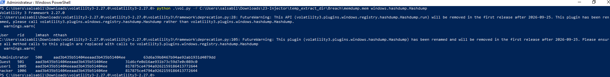

**Answer:** `817875ce4794a9262159186413772644`

> **Note:** this hash dump output is unusually short for a 32-character NT hash — worth re-verifying against the raw `vol.py` output before publishing, since hashdump results are typically `LM:NT` pairs of 32 hex characters each.

---

## Question 14 — What is the MITRE ATT&CK ID for the persistence technique used?

The attacker created a new **local** account (`hacker`) on the host rather than using an existing privileged account, a cloud identity, or a domain account, and later added it to the **Remote Desktop Users** group to retain remote access (see Question 17). This maps to the Persistence tactic, specifically:

**Answer:** `T1136.001` — *Create Account: Local Account* (Tactic: **Persistence**, TA0003)

---

## Question 15 — The attacker uploaded a simple command shell via a file upload vulnerability. What is the name of the URL parameter used to execute commands?

Filtering `access.log` for the uploaded shell path (`/dvwa/hackable/uploads/phpshell.php`) shows a sequence of GET requests passing OS commands directly through a query-string parameter, e.g. `?cmd=dir`, `?cmd=dir%20C:\\`, `?cmd=mkdir%20abc`. This is a classic single-parameter PHP webshell pattern (`<?php system($_GET['cmd']); ?>`).

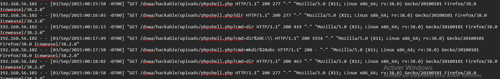

**Answer:** `cmd`

---

## Question 16 — One uploaded file has an MD5 starting with "559411". Provide the full hash.

Locating the uploaded files under `xampp\htdocs\DVWA\hackable\uploads` (and an extracted `webshell.zip` containing `c99.php` and `webshell.php`), hashed each candidate file with PowerShell:

```powershell
Get-FileHash -Algorithm MD5 .\webshell.php
```

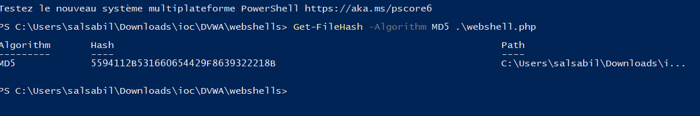
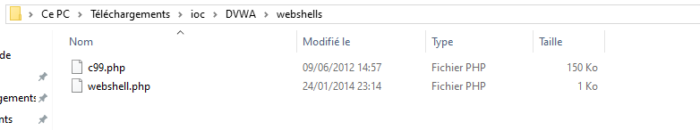

**Answer:** `5594112b531660654429f8639322218b`

---

## Question 17 — The attacker used Command Injection to add user "hacker" to the "Remote Desktop Users" group. Provide the IP address that was part of the executed command.

First, listed running processes in the memory dump to find the web server process serving the command injection request:

```powershell
python .\vol.py -f <path>\memdump.mem windows.pslist.PsList
```
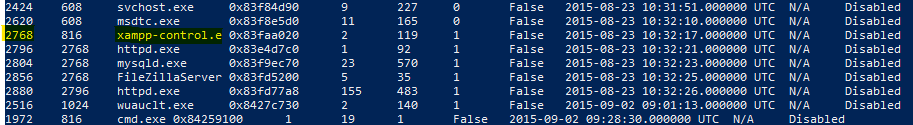

This identifies `httpd.exe` (PID 2768, parent `xampp-control.e`) as the relevant web server process.


Dumped that process's memory and extracted strings from it:

```powershell
python .\vol.py -f <path>\memdump.mem -o . windows.memmap --pid 2768 --dump
.\strings_tool\strings64.exe -accepteula -n 6 .\pid.2768-1.dmp > pid2768-1_strings.txt
```

Searching the extracted strings for `hacker` with surrounding context reveals the raw POST body of the command injection request, which embeds the source IP as part of the injected `net localgroup` command:

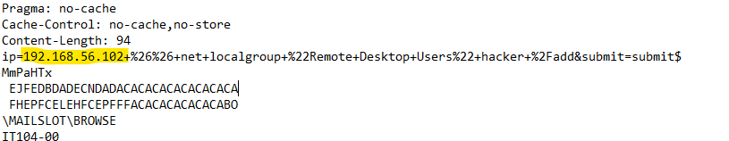


**Answer:** `192.168.56.102`

---

## Question 18 — The attacker dropped a shellcode through the SQLi vulnerability. The shellcode checks for a specific PHP version. Provide the PHP version number.

Filtering `access.log` for SQL injection requests against `/dvwa/vulnerabilities/sqli/` shows a large hex-encoded payload passed through the UNION-based injection, terminating in a request to a dropped file (`/htdocs/tmpudvfh.php`).

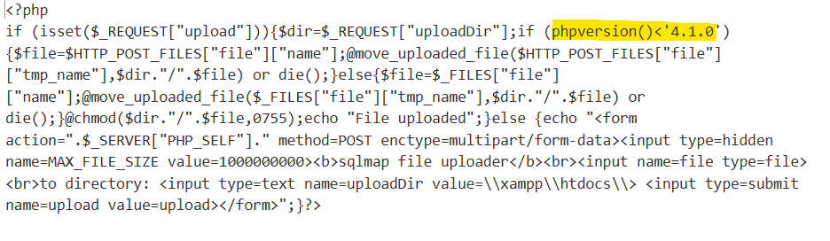

Decoding the hex string in CyberChef (From Hex) reveals a PHP file-uploader webshell. The script gates its upload functionality behind a version check, only allowing uploads if the running PHP interpreter is below version 4.1.0:

```php
if (isset($_REQUEST["upload"])){
    $dir=$_REQUEST["uploadDir"];
    if (phpversion() < '4.1.0') { ... }
}
```


**Answer:** `4.1.0`

---

## Attack Chain Summary

1. **Reconnaissance / Initial Access** — Attacker discovers a XAMPP server hosting DVWA and begins probing its intentionally vulnerable modules, starting with an **XSS** payload against the DVWA security settings page.
2. **Exploitation (SQLi)** — Using `sqlmap`, the attacker enumerates the backend database via the SQLi module, then abuses `SELECT ... INTO OUTFILE` to drop a PHP file-uploader webshell (`tmpudvfh.php`) directly onto the web root.
3. **Exploitation (LFI)** — In parallel, the attacker abuses the File Inclusion module to read sensitive local files, including the Windows `hosts` file, to fingerprint the target environment.
4. **Execution** — The dropped uploader is used to push a second-stage webshell (`webshell.php`) to `hackable/uploads/`, exposing a `cmd` parameter for arbitrary command execution.
5. **Privilege Escalation / Persistence** — Through the command-execution webshell, the attacker runs a command injection payload that creates a new local user (`hacker`) and adds it to the **Remote Desktop Users** group (MITRE `T1136.001`).
6. **Defense Evasion** — The attacker modifies the Windows Firewall (`netsh firewall set service type=remotedesktop mode=enable scope=subnet`) to permit inbound RDP traffic for the new account.
7. **Persistence / C2 Channel** — With RDP access enabled and a local account in hand, the attacker establishes a durable remote foothold on the host independent of the web application layer.


